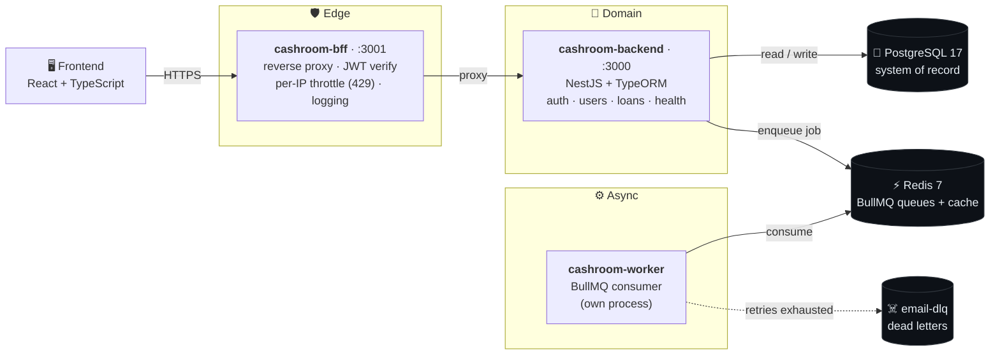
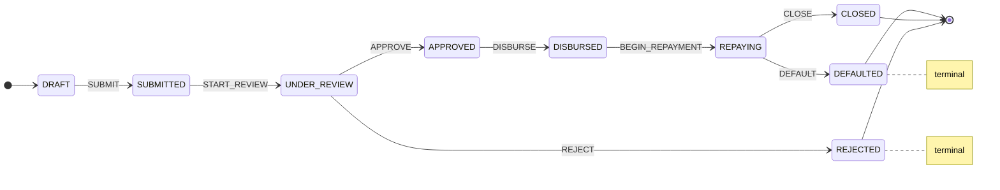

<!--
  ─────────────────────────────────────────────────────────────────────────
  Cashroom — README
  A few links below are placeholders (marked YOUR-...). Drop in your real
  GitHub username + LinkedIn handle and you're done.
  ─────────────────────────────────────────────────────────────────────────
-->

<div align="center">

# 💸 Cashroom

### A production-grade **student lending backend**, built from scratch.

*Queue-driven workflows, a state-machine loan lifecycle, and reliability patterns that take the manual toil out of money movement.*

<br/>

[](https://nestjs.com/)
[](https://www.typescriptlang.org/)
[](https://www.postgresql.org/)
[](https://redis.io/)
[](https://docs.bullmq.io/)
[](https://stately.ai/docs/xstate)
[](https://typeorm.io/)
[](https://docs.docker.com/compose/)


</div>

---

> [!NOTE]
> **Why this exists.** I build payments & settlement systems for a living — multi-lender bank
> integrations, reconciliation, and queue-driven retry systems. **Cashroom is where I rebuild
> those patterns from first principles, in the open:** a lending backend that treats money as a
> first-class citizen, models a loan's life as an explicit state machine, and never loses a job to
> a flaky dependency. It's a portfolio piece and a sandbox — every design choice is documented with
> the *why*, not just the *how*.

<br/>

## 🧭 The 30-second tour

Cashroom is a NestJS monorepo split into three cooperating processes, wired together with Docker Compose:



> The browser only ever talks to the **BFF**. It verifies access tokens, rate-limits per IP, logs every
> request, and proxies to the domain API by service name — so auth, throttling, and observability live at
> the edge, and the backend stays focused on business logic. *Defense in depth, not a single wall.*

<br/>

## ✨ What's inside

<table>
<tr>
<td width="50%" valign="top">

### 🔐 Auth that respects the threat model
- `signup` / `signin` / `refresh` with **JWT access + refresh rotation**
- `bcrypt` password hashing (12 rounds)
- Refresh tokens stored as a **SHA-256 hash** (`select: false`) — a DB leak can't be replayed
- Generic `401`s — no account enumeration

</td>
<td width="50%" valign="top">

### 🔁 Queues that never drop a job
- BullMQ `email` queue on Redis
- **3 attempts, exponential backoff** (~1s → 2s → 4s)
- Explicit **Dead Letter Queue** + inspect/replay CLI
- **Bull Board** UI at `/admin/queues`
- Worker runs as its **own process** — a stuck job can't starve the API

</td>
</tr>
<tr>
<td width="50%" valign="top">

### 🧮 Money modeled like money
- Principal is **`bigint` paise** — never a JS `number`
- Interest rate in **basis points** (integer) — no float rounding
- DB `CHECK` constraints + typed enums guarding every column

</td>
<td width="50%" valign="top">

### 🚦 A loan lifecycle you can't corrupt
- **XState** machine as the single source of truth for legal transitions
- Used as a *pure validator*, not a running actor — the DB row is the truth
- Illegal moves (`APPROVE` a `DRAFT`, `DISBURSE` a `REJECTED` loan) are **impossible to persist**

</td>
</tr>
</table>

<br/>

## 🚦 The loan lifecycle

Every loan is a row in Postgres whose `status` column is the source of truth. The XState machine in
[`loan.machine.ts`](cashroom-backend/src/loan/loan.machine.ts) answers one question — *"is this
transition legal from where the loan is right now?"* — and the service persists the new status only
if the answer is yes.



> [!TIP]
> **Why not a long-lived actor per loan?** A loan lives for *months*, across thousands of stateless HTTP
> requests and server restarts — there's no in-memory process to keep alive. So the machine is treated as
> a pure `(status, event) → nextStatus | null` function. Same rules, zero runtime state. Each milestone
> (`SUBMIT`, `APPROVE`, `DISBURSE`, …) also stamps its own audit timestamp.

<br/>

## 🔁 Anatomy of a resilient job

The classic trap: sending a verification email *synchronously* inside signup. A slow provider adds latency;
a down provider **fails account creation** for a problem that has nothing to do with the user. Cashroom
decouples it — signup returns `201` immediately, and the email is delivered asynchronously with retries.

```mermaid
sequenceDiagram
    autonumber
    actor U as User
    participant API as Backend
    participant Q as Redis · email queue
    participant W as Worker
    participant D as email-dlq

    U->>API: POST /auth/signup
    API->>API: create user (Postgres)
    API-)Q: enqueue send-verification-email
    API-->>U: 201 Created  ⟵ fast, non-blocking

    Q->>W: attempt 1
    W--xQ: transient failure
    Note over Q,W: backoff ~1s
    Q->>W: attempt 2
    W--xQ: transient failure
    Note over Q,W: backoff ~2s
    Q->>W: attempt 3
    W->>W: "Would send email…" ✅

    rect rgb(60, 20, 20)
    Note over W,D: If a job exhausts all retries →<br/>moved to email-dlq, never lost.<br/>Inspect + replay from the CLI.
    end
```



> [!IMPORTANT]
> **Known limitation, flagged on purpose:** the user is committed to Postgres *and then* the job is
> enqueued to Redis — two systems, not one atomic write. The production-grade fix is the **transactional
> outbox** pattern. Here, enqueue is wrapped in `try/catch` (a Redis blip logs an error but never fails
> signup) as a pragmatic stand-in. Honest trade-offs > hidden ones.

<br/>

## 🛠️ Tech stack

| Layer | Choice | Why |
|---|---|---|
| **Framework** | NestJS 11 + TypeScript 5.7 | DI, modules, and testability out of the box |
| **Persistence** | PostgreSQL 17 + TypeORM | Relational system-of-record; migrations, not `synchronize` |
| **Queues / cache** | Redis 7 + BullMQ 5 | At-least-once jobs, retries, backoff, DLQ |
| **State** | XState 5 | Loan transitions as an explicit, testable machine |
| **Auth** | `@nestjs/jwt` + `bcrypt` | Stateless access tokens, rotating refresh tokens |
| **Validation** | `class-validator` + `class-transformer` | DTO-validated REST at the boundary |
| **Edge** | cashroom-bff | Reverse proxy, per-IP throttle, edge JWT verify, logging |
| **Infra** | Docker Compose | One command spins up the whole system, with healthchecks |
| **Tests** | Jest (unit + e2e) | Fast unit loop; e2e on completion |

<br/>

## 🚀 Quick start

> **Prereqs:** Docker + Docker Compose. That's it — Postgres, Redis, the API, the BFF, and the worker all come up together.

```bash
# 1. Clone
git clone https://github.com/YOUR-USERNAME/cashroom.git
cd cashroom

# 2. Configure — copy the template, then fill in local secrets
cp .env.example .env          # PowerShell:  Copy-Item .env.example .env

# 3. Bring the whole system up
docker compose up --build

# 4. Apply DB migrations from the host (the lean prod image omits ts-node)
cd cashroom-backend
npm install
npm run migration:run
```

Once it's up:

| Surface | URL |
|---|---|
| 🛡️ BFF (talk to this) | `http://localhost:3001` |
| 🧠 Backend API | `http://localhost:3000` |
| ❤️ Health check | `http://localhost:3000/health` → `{ "status": "ok", "db": "connected" }` |
| 📊 Bull Board (queues) | `http://localhost:3000/admin/queues` |

<details>
<summary><b>🧑‍💻 Run the backend locally (without Docker)</b></summary>

<br/>

```bash
cd cashroom-backend
npm install

npm run start:dev     # API with hot reload
npm run worker:dev    # BullMQ worker (separate process)

# Queue toolbox
npm run queue:inspect   # counts + peek at the DLQ
npm run queue:demo-dlq  # enqueue a job that always fails → lands in the DLQ
npm run queue:replay    # re-enqueue dead-lettered jobs back onto `email`

# Migrations
npm run migration:generate
npm run migration:run
npm run migration:revert

# Quality gates
npm run test            # Jest unit
npm run test:e2e        # end-to-end
npm run lint            # eslint --fix
```

</details>

<br/>

## 📡 API reference

<details>
<summary><b>🔐 Auth</b> — <code>/auth</code></summary>

<br/>

| Method | Endpoint | Body | Success | Notes |
|---|---|---|---|---|
| `POST` | `/auth/signup` | `SignupDto` | `201` `SafeUser` | Duplicate email → `409`, invalid body → `400`. Enqueues a verification-email job. |
| `POST` | `/auth/signin` | `SigninDto` | `200` `{ accessToken, refreshToken }` | Bad credentials → `401` (generic, no enumeration). |
| `POST` | `/auth/refresh` | `RefreshDto` | `200` `{ accessToken, refreshToken }` | **Rotates** the pair. Reused/expired/invalid token → `401`. |

Access tokens expire in **15m**, refresh tokens in **7d**. Roles: `student` (default) · `admin`.

</details>

<details>
<summary><b>❤️ Health</b> — <code>/health</code></summary>

<br/>

| Method | Endpoint | Response |
|---|---|---|
| `GET` | `/health` | `{ "status": "ok", "db": "connected" \| "disconnected" }` — the cheapest round-trip (`SELECT 1`) that proves the DB answers. |

</details>

<details>
<summary><b>🚦 Loans</b> — <code>/loan</code> <em>(domain modeled; REST surface in progress)</em></summary>

<br/>

The loan **domain, state machine, and service** are complete — `LoanService.applyTransition()` is the
only place a status may change, and it defers to the XState machine for legality. The HTTP controller that
exposes these transitions is next on the roadmap. Today the flow is fully unit-tested at the service +
machine layer.

</details>

<br/>

## 🗂️ Project structure

<details>
<summary><b>Expand the tree</b></summary>

<br/>

```
cashroom/
├── docker-compose.yml          # Postgres · Redis · backend · bff · worker (+ healthchecks)
├── .env.example                # documented env template (secrets live in .env, gitignored)
├── learning/                   # one note per build step — the "why" behind every decision
│
├── cashroom-backend/           # 🧠 domain API (NestJS + TypeORM)
│   └── src/
│       ├── auth/               # signup · signin · refresh · JWT guard · rotation
│       ├── user/               # User entity · roles (RBAC) · email verification flag
│       ├── loan/               # entity · XState machine · service (transition guard)
│       ├── queue/              # BullMQ names · payloads · connection · CLI (inspect/replay)
│       ├── worker/             # BullMQ consumer · email processor · DLQ handler
│       ├── database/           # DataSource · migrations
│       ├── health/             # GET /health
│       └── common/             # BaseEntity · exception filter · validators
│
└── cashroom-bff/               # 🛡️ edge: reverse proxy · JWT verify · throttle · logging
```

</details>

<br/>

## 🧠 Engineering decisions (the interesting part)

<details>
<summary><b>Why these choices — and their trade-offs</b></summary>

<br/>

- **Money is `bigint` paise, never `number`.** JS floats silently lose precision past 2⁵³; on money that's
  a bug you find in production. Amounts are stored as `bigint` in the smallest unit; interest is in integer
  **basis points** (1200 = 12.00%). Percentages are for display only.
- **The state machine is a validator, not a process.** No `createActor().start()` — a loan can't hold an
  in-memory actor across months and restarts. The machine is a pure function; the DB is the truth.
- **The worker is a separate process.** Same image, different entrypoint (`node dist/worker/main.worker`).
  A slow or stuck job can't block API request handling, and workers scale independently of the API.
- **Refresh tokens are hashed and rotated.** Only a SHA-256 hash is persisted (`select: false`), so a DB
  leak can't be replayed; each refresh mints a new pair (single active session).
- **DLQ + replay over silent loss.** A job that exhausts its retries is dead-lettered, inspectable, and
  replayable — the same "no failed transfer left behind, no manual re-push" instinct that removes ops toil
  from real money movement.
- **Concurrency is flagged, not faked.** `applyTransition` is a read-modify-write; the plan is a conditional
  `UPDATE ... WHERE status = ?` or the Redis lock helper once concurrent callers exist. Documented in code.

</details>

<br/>

## 🗺️ Roadmap

| | Milestone |
|---|---|
| ✅ | Dockerized infra — Postgres + Redis with healthchecks & named volumes |
| ✅ | NestJS scaffold, TypeORM, migrations, `/health` |
| ✅ | User entity, RBAC roles, DB `CHECK` constraints |
| ✅ | Signup + signin + JWT access/refresh with rotation |
| ✅ | Loan domain + XState lifecycle + service-layer transition guard |
| ✅ | BullMQ queue + worker + DLQ + Bull Board + CLI |
| ✅ | BFF edge — proxy, per-IP throttle, edge JWT verify, logging |
| 🚧 | Loan REST endpoints (application → decision → disbursal → repayment) |
| 🚧 | `/auth/verify` — consume the verification token, flip `isEmailVerified` |
| 📋 | Eligibility checks + repayment schedule generation |
| 📋 | Redis distributed lock on loan transitions |
| 📋 | React + TypeScript frontend |

<br/>

## 📚 Learning notes

This repo doubles as a build log. [`learning/`](learning/) has **one note per step**, each ending with a
*"Things to question"* section — deliberate critical-thinking prompts about the trade-offs made.

| # | Topic |
|---|---|
| 01 | Docker Compose: Postgres + Redis infrastructure |
| 02 | NestJS scaffold: modules, TypeORM, `/health` |
| 03 | User entity & first migration (bigint PK, `CHECK`, RBAC, migrations vs `synchronize`) |
| 04 | Signup: DTO validation, bcrypt, exception handling |
| 05 | Signin, JWT, refresh tokens & guards (rotation, stateless auth) |
| 06 | Loan domain & lifecycle state machine (XState as validator, bigint money, basis points) |
| 07 | The BFF: reverse proxy, rate limiting (429), structured logging, edge JWT |

<br/>

---

<div align="center">

### 👋 Built by Arul Goyal

Backend engineer on a payments & settlement team — multi-lender bank integrations, reconciliation, and queue-driven retry systems. Bengaluru, India.

[](mailto:arulgoyal6@gmail.com)
[](https://www.linkedin.com/in/YOUR-HANDLE)
[](https://github.com/YOUR-USERNAME)

<sub>⭐ If Cashroom's approach to reliability and clean domain modeling resonates, star the repo — it's an ongoing build.</sub>

</div>
